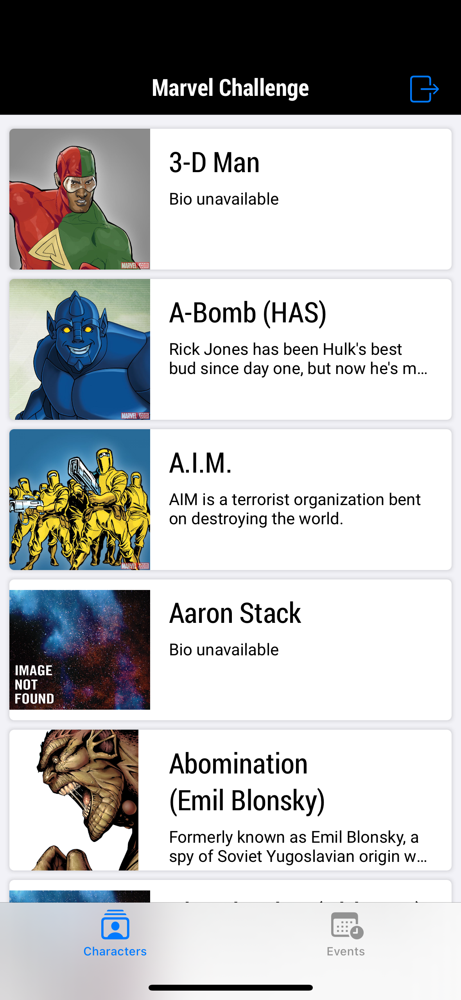
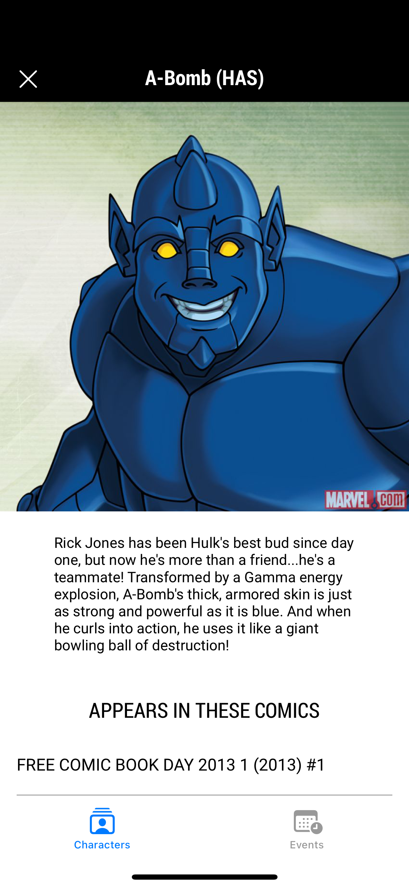
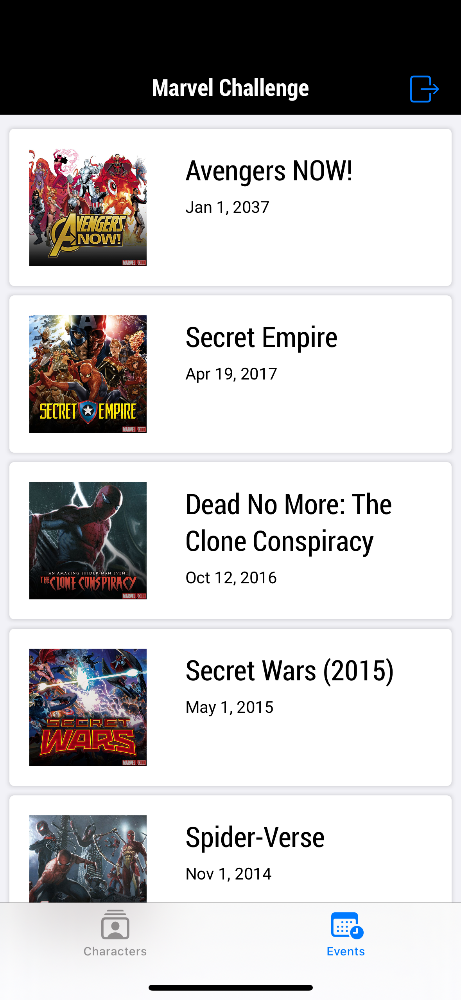
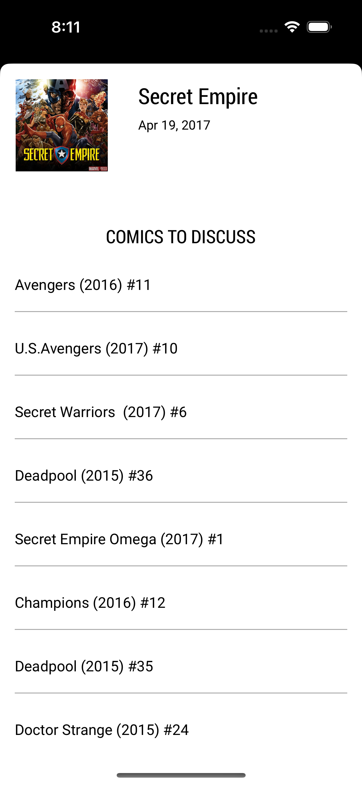

## Table of contents
* [General info](#general-info)
* [Technologies](#technologies)
* [Design pattern chosen](#design-pattern-chosen)
* [Setup](#setup)
* [Improvements](#improvements)
* [Known issues](#known-issues)

## General info

This project is a Marvel catalog browser, done in about a 40 hour span, with the capabilities to:
- Log in into the app, and have auto log-in as well
- Browse over a series of characters
- Get additional info on those characters and on which comics they appeared
- Browse over a series of events
- Get additional info on those events and which comics surround them
	
## Technologies
Project is created with:
* Firebase
* VIPER design pattern
* CocoaPods dependency manager
* Alamofire framework
* Codable protocol
* SDWebImage library
* XCTest
* The Marvel Comics API own free public REST API (https://developer.marvel.com/docs#!/)

## Design pattern chosen
VIPER was chosen as an optimal way to modularize and encapsulate properly responsibilities for each screen, this allows for better decoupling and this as well makes it easier to debug and test features.
	
## Setup
To run this project, install the required frameworks using CocoaPods:

```
$ cd ../Marvel app
$ pod install
```

## Improvements
Not necessary because it's just a coding challenge but for a proper application to be consumed by users, application keys should be encrypted through certain means (cocoapods-keys could be one way). Also, for sure the app would benefit from searching features if anyone wanted to look up a specific character.

## Known issues
The challenge stated to list the first 25 future events but through Marvel's API there only seems to be actually one event that complies. I decided to show then, the latest 25 events available in the database.
